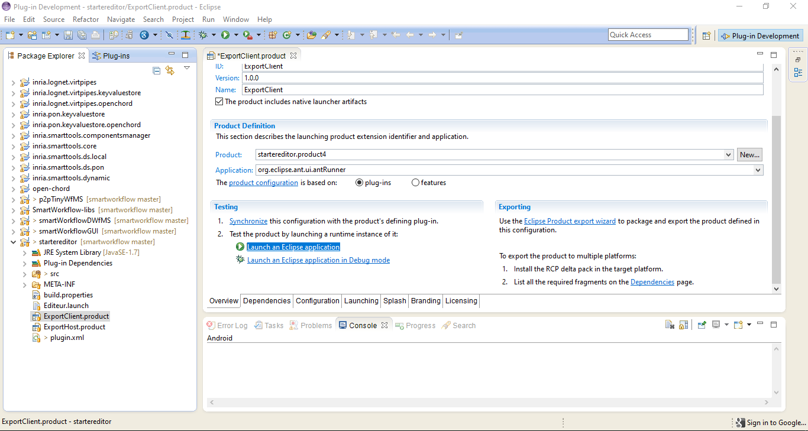

# P2PTinyWfMS #
This is the repository on which you can find the source code of the WfMS prototype named "P2PTinyWfMS" and introduced in the paper *"A Grammatical Approach for Administrative Workflow Design and their Distributed Execution using Structured and Cooperatively Edited Mobile Artifacts"*.

P2PTinyWfMS enables the simulation on a workstation, of the decentralised execution of administrative processes which are specified in a grammar-based language. The decentralised execution model is the one presented in the paper *"A Grammatical Approach for Administrative Workflow Design and their Distributed Execution using Structured and Cooperatively Edited Mobile Artifacts"*.

# Setting up the environment #

## Required tools ##
The required tools to be able to conduct the experiment of decentralised process execution using P2PTinyWfMS are the following:

- This repository's full content
- Java 8 32 bits: you can download it on [https://www.java.com/fr/download/manual.jsp](https://www.java.com/fr/download/manual.jsp "Download Java 8 32 bits on java.com")
- A version of [Eclipse](https://www.eclipse.org/ "Eclipse Foundation Website") on which the [Shared-data Overlay Network (SmartTools)](http://www-sop.inria.fr/members/Didier.Parigot/pmwiki/SON/index.php/Main/HomePage "Learn more on SON") development platform is installed. To make it simpler, we have zipped and put online the Eclipse version that we used: [it can be downloaded through this link](https://drive.google.com/file/d/1bq2Eii25PfKJ91Wgi3dpJ-GrXjIByWWw/view?usp=sharing "Download the eclipse with SON"). It is a 32-bit Eclipse: hence the need to use a 32-bit Java.

## Installation ##
The installation and configuration of the environment is quite simple. Precisely, it is necessary to:

- Install Java 8 32 bits and configure the *path* environment variable of your system
- Unzip the provided version of Eclipse into a directory of your choice
- Start Eclipse and import the supplied projects from this repository in the following order:
	-	First of all all the projects contained in the archive in the `SON-Artifacts` directory; these are required dependencies for the prototype's operation
	-	Next, the `SmartWorkflow-libs` project; this project contains additional dependencies
	-	Then, the `p2pTinyWfMS` project; this is where all the prototype code and the specifications of the proposed examples are stored
	-	And finally, the `startereditor` project; it is in this project that the deployment maps are configured for launching simulations

# Starting the default simulation #
As provided here, the environment allows to simulate by default, the example described in the paper *"A Grammatical Approach for Administrative Workflow Design and their Distributed Execution using Structured and Cooperatively Edited Mobile Artifacts"*: it is the peer review process of a scientific article.

To simulate this process, you just need to open the `ExportClient.product` file of the `startereditor` project and click on the `Launch an Eclipse application` link/button of the Overview tab (see the image below).

Four instances of P2PTinyWfMS will then be launched. **If you are asked to choose a workspace, it is best to indicate that you want to use the default workspace** (the one in which your eclipse.exe is located). You can simulate the peer review process decentralised execution by navigating between instances of P2PTinyWfMS.

# A video to find out more #
We have prepared a short video in which we simulate the peer-review process as well as another light process on claiming damages from an insurance company. This video can help you to find out more and give you the keys to simulate your own example in this experimental environment. The video can be accessed through this link: [https://www.youtube.com/watch?v=tMwdlfDZSus&pbjreload=101](https://www.youtube.com/watch?v=tMwdlfDZSus&pbjreload=101 "A video to find out more").

Thank you for your interest and we hope you will enjoy the experience with this embryonic prototype.

